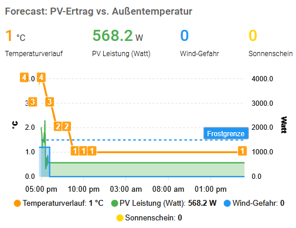

# WetterOnline Add-on Repository

This Repository contains the Home Assistant Add-on "WetterOnline Scraper".
<p align="center">
  
</p>

**Motivation for the Add-on:** I checked severeal avaialble weather services like DWD or AccuWeather over months, none of them provide a so precise forecast like wetteronline for my home town.

**Scope:** The Add-on, optimized for ODROID-N2+ / HA Blue, scrapes from wetteronline the temperature, weather condition as well as wind for the next 24 hours and makes them available as entities via MQTT. Check the Wiki/Examples for the **ApexCharts-Card** YAML configuration to visualize the 24h temperature fever curve and wind staircases.

The scraper uses Playwright to penetrate the Shadow-DOM layers and dynamic Angular components of WetterOnline, which are typically invisible to standard scrapers.

**Installation:** via Add-on store by adding the link to github repository (3 dots upper right corner)

If you notice problems after installation of Add-on:
- **1:** check, whether you added in the config of the Add-on your MQTT user name and password as well as location 
- **2:** for debugging see following lines
### Debugging & Manual Test
If you notice missing entities or values, run the following command in the **Advanced SSH & Web Terminal** (logged in as root via port 22):
```bash
docker exec -it -e MQTT_USER='your_user' -e MQTT_PASSWORD='your_password' addon_XXXXX_wetteronline python3 /usr/src/app/scraper.py
Ensure you use "-it" and the single quotes (') for the password in the terminal command to avoid issues with special characters.
Note: Replace XXXXX with your specific local repository ID. You can find it by running: docker ps or docker exec hassio_supervisor ls /data/addons/git.
```
### Disclaimer & Maintenance
**Please Note:** This scraper relies on the specific HTML structure of WetterOnline. If they update their website layout (especially the Shadow-DOM or CSS classes), the scraper might stop fetching data correctly.
- **Maintenance:** If you notice "0 pairs found" in your logs, please open an **Issue** here on GitHub.
- **Usage:** This project is for private, educational use and solar optimization. Please respect the website's terms of service and do not set the scrape interval too low to avoid unnecessary server load.
